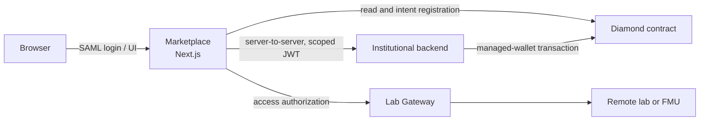

# DecentraLabs Marketplace

Marketplace is the Next.js application through which institutional users discover, reserve and access remote laboratories. It coordinates the browser, the institutional backend, the on-chain Diamond contract and the provider's Lab Gateway; it does not custody an end user's wallet or expose a private key in the browser.

## Current product model

- Users authenticate with institutional SAML SSO.
- An institution owns the backend and managed wallet that authorize and execute its operations.
- Service credits are internal, non-cash-redeemable settlement units.
- Reservations and provider changes are authorized through signed intents and a WebAuthn ceremony in the institutional backend.
- The deployed contract and its ABI are the source of truth for on-chain state. Marketplace consumes the generated ABI in `src/contracts/diamondAbi.json`.



The active chain configuration defaults to Sepolia. Configuring another network in a client library is not a production release; the contract address, ABI and deployment validation must be changed together.

## Start locally

Use Node.js 22 and npm 10 or later.

```bash
npm ci
npm run dev
```

`npm run dev` starts Next.js with Turbopack. Configure a development SAML identity provider, RPC endpoint, contract address and server-side session store before testing an institutional flow. Do not copy secrets into source files or `NEXT_PUBLIC_*` variables.

## Documentation map

| Need | Start here |
| --- | --- |
| Use the Marketplace | [Access laboratories](docs/access-laboratories.md) |
| Fund laboratory access as an institution | [Become a consumer](docs/become-a-consumer.md) |
| Publish a laboratory | [Become a provider](docs/become-a-provider.md) |
| Browse the public documentation | [Documentation guide](docs/README.md) |

The public FAQ and legal pages are rendered from `src/app/(marketing)/`. They are operational content, not a replacement for an approved legal notice. Private implementation and legal-review notes remain under `dev/` for local agent and maintainer use.

## Verification commands

Run the narrowest relevant command first. The normal local baseline is:

```bash
npm run lint
npm run test:critical
npm run build
```

Additional test, Cypress, live-integration and provisioning-audit commands are documented in the private `dev/` notes.

## Documentation maintenance

When changing authentication, provisioning, institutional intents, reservations, credits, metadata, catalogue behaviour or lab access, update the affected audience guide and its technical reference in the same change. Do not document an endpoint, environment variable or protocol field until it exists in this repository and, when applicable, in the canonical `Lab Gateway/blockchain-services` backend.
