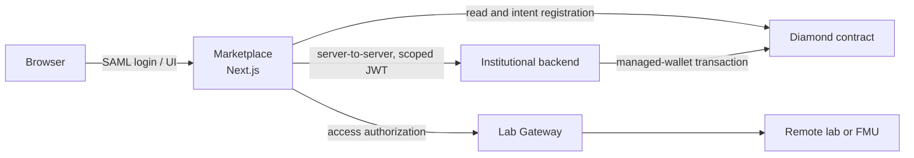

# DecentraLabs Marketplace

DecentraLabs Marketplace is the institutional catalogue for discovering,
reserving and accessing remote laboratories and FMU simulations. Students,
researchers and staff use their institution's identity; providers operate the
laboratory infrastructure and publish its availability through the platform.

## Start here

| If you want to... | Read |
| --- | --- |
| Use a laboratory as a student, researcher or staff member | [Access laboratories](docs/access-laboratories.md) |
| Set up your institution as a consumer | [Become a consumer](docs/become-a-consumer.md) and [Credits and funding](docs/consumer/credits-and-funding.md) |
| Publish and operate a laboratory | [Become a provider](docs/become-a-provider.md) |
| Understand reservation states and cancellation | [Reservations and cancellations](docs/reservations-and-cancellations.md) |
| Prepare lab metadata | [Marketplace metadata integration](docs/provider/metadata-integration.md) |
| Diagnose a failed login, booking or access attempt | [Troubleshooting](docs/troubleshooting.md) |

## Current product model

- Users authenticate with institutional SAML SSO.
- An institution owns the backend and managed wallet that authorize and execute its operations.
- Service credits are internal, non-cash-redeemable settlement units.
- Reservations and provider changes are authorized through signed intents and a WebAuthn ceremony in the institutional backend.
- The deployed contract and its ABI are the source of truth for on-chain state. Marketplace consumes the generated ABI in `src/contracts/diamondAbi.json`.
- Marketplace does not custody a user's personal wallet or expose a private key in the browser.


```mermaid
flowchart LR
    Browser[Browser] -->|SAML login / UI| Marketplace[Marketplace\nNext.js]
    Marketplace -->|read and intent registration| Diamond[Diamond contract]
    Marketplace -->|server-to-server, scoped JWT| Institution[Institutional backend]
    Institution -->|managed-wallet transaction| Diamond
    Marketplace -->|access authorization| Gateway[Lab Gateway]
    Gateway --> Lab[Remote lab or FMU]
```

The active chain configuration defaults to Sepolia. Configuring another network in a client library is not a production release; the contract address, ABI and deployment validation must be changed together.

## For contributors

Use Node.js 22 and npm 10 or later to run the application locally:

```bash
npm ci
npm run dev
```

`npm run dev` starts Next.js with Turbopack. Configure a development SAML
identity provider, RPC endpoint, contract address and server-side session store
before testing an institutional flow. Do not copy secrets into source files or
`NEXT_PUBLIC_*` variables.

## Public documentation

The complete user-facing map is in [SUMMARY.md](SUMMARY.md). The live
[FAQ](https://marketplace-decentralabs.vercel.app/faq),
[contact page](https://marketplace-decentralabs.vercel.app/contact),
[privacy notice](https://marketplace-decentralabs.vercel.app/privacy),
[terms](https://marketplace-decentralabs.vercel.app/terms),
[cookies notice](https://marketplace-decentralabs.vercel.app/cookies) and
[security page](https://marketplace-decentralabs.vercel.app/security) are part
of the operational product experience.

For technical integration work, use the linked project documentation from the
relevant user guide. The Marketplace repository is not a substitute for the
Lab Gateway, canonical backend or Lab-Metadata documentation.

## Contributor verification commands

Run the narrowest relevant command first. The normal local baseline is:

```bash
npm run lint
npm run test:critical
npm run docs:check
npm run build
```
