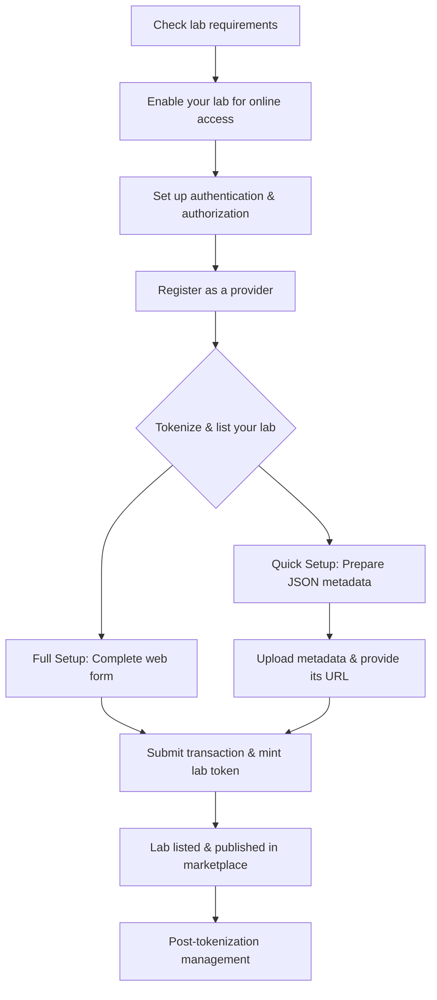

# Graphical overview

This diagram summarizes the key steps to become a lab provider on DecentraLabs:

```
A[📋 Check lab requirements] --> B[🌐 Enable online access for your lab]
[B] --> C[🔑 Authentication & authorization setup]
[C] --> D[📝 Register as a provider in DecentraLabs]
[D] --> E[🔗 Define metadata and access conditions to tokenize and list the lab]
[E] --> G[✅ Lab published in DecentraLabs marketplace]
```



The image below illustrates the architecture of the infrastructure you must have at your institution:

<figure><figcaption></figcaption></figure>
