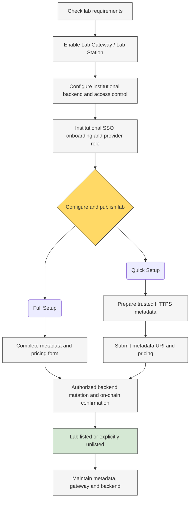

# Graphical overview

This diagram summarizes the current institutional path to become a lab provider on DecentraLabs:

```mermaid
flowchart TD
    A[Check lab requirements]:::step --> B[Enable Lab Gateway / Lab Station]:::step
    B --> C[Configure institutional backend and access control]:::step
    C --> D[Institutional SSO onboarding and provider role]:::step

    D --> E{"Configure and publish lab"}:::decision

    E --> F1(Full Setup)
    F1 --> F11[Complete metadata and pricing form]:::step
    F11 --> G1[Authorized backend mutation and on-chain confirmation]:::step

    E --> F2(Quick Setup)
    F2 --> F21[Prepare trusted HTTPS metadata]:::step
    F21 --> F22[Submit metadata URI and pricing]:::step
    F22 --> G1

    G1 --> H[Lab listed or explicitly unlisted]:::result
    H --> I[Maintain metadata, gateway and backend]:::step

    classDef step fill:#f5f5f5,stroke:#333,stroke-width:1px;
    classDef decision fill:#ffd966,stroke:#333,stroke-width:1px;
    classDef result fill:#d5e8d4,stroke:#333,stroke-width:1px;
```

The image below illustrates the infrastructure required at the institution:

<figure><figcaption></figcaption></figure>
