# Graphical overview

This diagram summarizes the key steps to become a lab provider on DecentraLabs:

```mermaid
flowchart TD
    A[📋 Check lab requirements] --> B[🌐 Enable your lab for online access]
    B --> C[🔑 Set up authentication & authorization]
    C --> D[📝 Register as a provider]

    D --> E{🔗 Tokenize & list your lab}

    E --> F1[⚙️ Full Setup: Complete web form]
    F1 --> G1[Submit transaction & mint lab token]

    E --> F2[⚡ Quick Setup: Prepare JSON metadata]
    F2 --> G2[Upload metadata & provide its URL]
    G2 --> G1

    G1 --> H[✅ Lab listed & published in marketplace]
    H --> I[🛠️ Post-tokenization management]

```

The image below illustrates the architecture of the infrastructure you must have at your institution:

<figure><figcaption></figcaption></figure>
