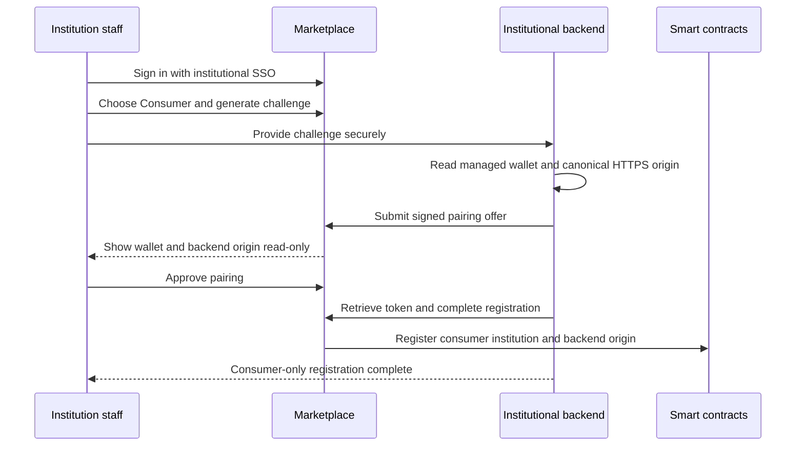

# Become a Consumer

A consumer institution uses DecentraLabs to fund and authorize laboratory access
for its students, researchers and staff. It does not need to publish its own
laboratories or run a provider gateway.

The consumer model is institutional: the backend and managed institutional wallet
authorize operations, while Marketplace provides the catalogue, reservation flow
and access hand-off. A personal browser wallet, browser-side gas payment and
transferable `$LAB` payment are not part of this flow.

## What you need

Before starting, the institution needs:

- an institutional SSO identity;
- an authorized member of institutional staff to perform registration; and
- an institutional `blockchain-services` backend reachable through its canonical
  HTTPS origin, with its managed wallet configured.

The Marketplace registration privilege is granted to the institutional-admin
entitlement or, under the current temporary onboarding policy, an SSO affiliation
of `faculty`, `staff` or `employee`. A student, alumni or guest account cannot
register an institution by itself.

The institution should also arrange its service-credit funding and spending
policy with its backend operator. Service credits are internal settlement units:
they are not personal wallet funds, cash or a transferable ERC-20 balance.

## Register the institution

1. Sign in through **Institutional Login** and open `/register`.
2. Choose **Consumer**.
3. Select **Generate pairing challenge**. Marketplace creates a short-lived
   challenge from the verified SSO institution. Do not create or type a wallet,
   backend URL or institution identifier in the browser.
4. Send the challenge to the institution's approved backend operator through a
   secure internal channel.
5. The backend operator enters the challenge in the backend's institutional
   configuration flow. The backend reads its configured managed wallet and
   canonical HTTPS origin, signs the pairing declaration and sends the offer to
   Marketplace.
6. Review the wallet address and exact backend origin shown by Marketplace. They
   are read-only values. Approve the pairing only when the institution controls
   both values.
7. Marketplace issues a short-lived provisioning token. The backend retrieves
   it with the original challenge and completes consumer registration.

Pairing challenges and provisioning tokens are short-lived and single-use. If a
challenge expires or is cancelled, generate a new one instead of reusing it.

## What consumer registration enables

Consumer registration associates the institution's normalized SSO organization,
managed wallet and canonical backend origin with the on-chain institutional
registry. The backend then runs in consumer-only mode:

- the institution can manage its credit account, funding orders and spending
  limits through the backend;
- authorized users can browse listed laboratories and submit reservations;
- the institutional backend authorizes and executes the required intent and
  reservation operations; and
- Marketplace can perform consumer-side check-in before requesting access from a
  provider gateway.

Consumer registration does not grant the provider role, publish laboratories or
make the consumer backend the access gateway for a provider's laboratory. When a
reservation uses different consumer and provider backends, the consumer backend
completes institutional check-in first and the provider backend issues the
laboratory credential afterwards.

## After registration

Once the backend reports the institution as registered:

1. institution members sign in through Institutional Login;
2. they can see the reservations and credit information available to their
   organization;
3. they select a listed laboratory and request a time slot;
4. the institution's backend and the contract validate and execute the
   reservation; and
5. during the valid reservation window, Marketplace performs the access hand-off
   to the provider gateway.

See [Access Laboratories](access-laboratories.md) for the user reservation,
cancellation and access journey.

## Security rules

- Treat the pairing challenge and provisioning token as confidential, even
  though they expire quickly.
- Confirm the exact backend origin. Registering one HTTPS origin does not trust
  sibling or subdomain origins automatically.
- Never put the managed wallet private key, backend credentials or provisioning
  token in the browser, laboratory metadata or a public support ticket.
- Do not describe service credits as `$LAB`, cash, personal wallet balance or
  browser-side payment.

## Common issues

### The registration page denies access

The SSO session may not contain the institutional-admin entitlement or an allowed
temporary affiliation. Ask an authorized institutional administrator to perform
the pairing.

### The backend offer does not appear

Check that the operator entered the current challenge in the configured backend,
that the challenge has not expired, and that the backend can reach the Marketplace
origin. Generate a new challenge when necessary.

### The wallet or backend origin is incorrect

Do not approve the pairing. Cancel it, correct the backend configuration and
generate a new challenge. Marketplace does not accept browser overrides for
these values.

### The institution wants to publish laboratories

Consumer registration is intentionally insufficient for that purpose. Follow
[Become a Provider](become-a-provider.md) and its provider onboarding guides.
