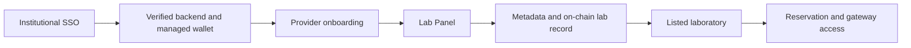

# Become a Provider

Providers join Marketplace through their institution. The active model combines institutional SSO, a verified institutional backend and a managed institutional wallet. A provider does not connect a personal wallet, choose a chain or pay browser-side gas in Marketplace.

## Provider journey

1. Check the [lab requirements](become-a-provider/lab-requirements.md).
2. Make the resource reachable through [Lab Gateway / Lab Station](become-a-provider/enable-your-lab-for-online-access.md).
3. Complete [institutional provider onboarding](become-a-provider/register-as-a-provider.md).
4. [Configure and publish the laboratory](become-a-provider/tokenize-and-list-your-lab.md).
5. Keep the gateway, backend, metadata and availability information operational.

## Key rules

- The institution's canonical HTTPS backend origin is trusted exactly; it does not imply trust for other subdomains.
- Service credits are internal settlement units. They are not `$LAB`, browser ERC-20 payments or cash-redeemable balances.
- A listed lab must still have a healthy gateway and backend. Listing is catalogue visibility, not an uptime check.
- Marketplace does not host FMU artifacts. Provision them in provider-controlled Lab Gateway/Lab Station infrastructure and refer to them through the configured access key.

For a visual overview, see [the provider flow](become-a-provider/graphical-overview.md). Detailed pairing and recovery guidance is maintained in the private developer documentation.
